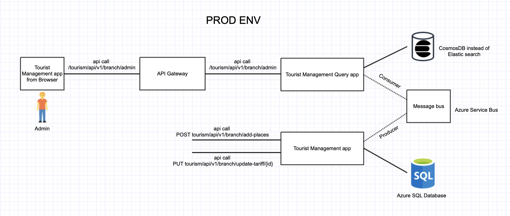

## Tourist Management Service
### Introduction
This is a simple web application for managing tourist information. It is developed using Spring Boot, Spring Data JPA, SQL Database. 

### Architecture

### Prerequisites to run on local
* Java 17
* Maven 3.8.2
* Kafka server running on port 9092
* MongoDB server running on port 27017
* H2 Database (local)

### Features
* Add, update tourist information
* Using CQRS pattern to separate read and write model
* Using Spring Data JPA to access database

### How to run
* Clone this repository
* Run `mvn clean install` to build the project
* Run `mvn spring-boot:run` to run the project on directory `tourist-management-app` && `tourist-management-query-app`
* Open `http://localhost:8082/h2-console` to access the database
* Open `http://localhost:8082/actuator` to access the actuator endpoints
* Open `http://localhost:8083/actuator` to access the actuator endpoints

### Testing with POSTMAN
[fse_assignment.postman_collection.json](fse_assignment.postman_collection.json)
Use the POSTMAN collection to test the API endpoints

### API Documentation
* Open `http://localhost:8082/swagger-ui.html` to access the API documentation

### References
* [Spring Boot](https://spring.io/projects/spring-boot)
* [Spring Data JPA](https://spring.io/projects/spring-data-jpa)
* [CQRS](https://martinfowler.com/bliki/CQRS.html)